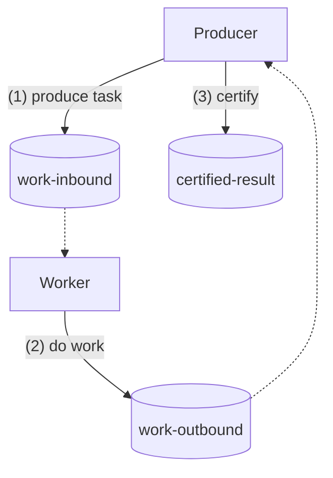
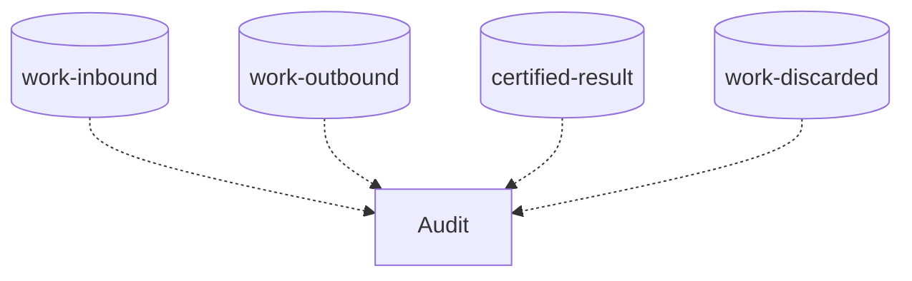

[](https://codesoapbox.dev/)

# RabbitMQ Example

This is an example of a RabbitMQ setup with 3 microservices:

- a producer
- a worker
- an audit service

The Producer produces tasks at a constant pace, sending them to the `work-inbound` exchange.
These tasks are processed by the Worker, which sends the results to the `work-outbound` exchange.
The Producer certifies the results and sends them to the `certified-results` exchange.


The Audit service observes all messages and offers analytical data via REST endpoints.



A task is considered stale if it has not been completely processed within 10 seconds - such tasks are discarded and
end up in the `work-discarded` Dead Letter exchange. 

## Getting Started

To run all services and their dependencies, go to `./docker` then run `docker-compose up -d`.

The microservices will be available under the following URLs:
- Producer - http://localhost:8080
- Worker - http://localhost:8081
- Audit - http://localhost:8082

The Producer can be enabled by visiting http://localhost:8080/enable
and disabled using http://localhost:8080/disable.
Additionally, it can be enabled for a given time using the `enable-timed` endpoint, e.g.:

http://localhost:8080/enable-timed?time-ms=30000

The Audit information can be viewed by visiting http://localhost:8082.

## Configuration properties

The Producer's pace of producing tasks can be altered using the `task-pace-ms` property.

The Worker's pace of processing tasks can be altered using the `processing-time-ms` property.
It can also be configured to fail every nth task using the `fail-every-nth-task` property
(a value of `0` means no tasks will fail).

## Code analysis

You can perform local code analysis of this project using SonarQube.

### Prerequisites

1. Go to the `./docker` folder
2. Execute `docker-compose -f docker-compose-sonar.yml up -d` to start a local Sonarqube instance
3. Visit http://localhost:9000/
4. Log in with the credentials `admin:admin`
5. Update the password when prompted

### Running the analysis

You can run the analysis using the following command in the repository root:

```shell
mvn clean verify sonar:sonar -Pcode-coverage -Dsonar.login=your_username -Dsonar.password=your_password
```

After a successful analysis, the report will be available at http://localhost:9000/projects